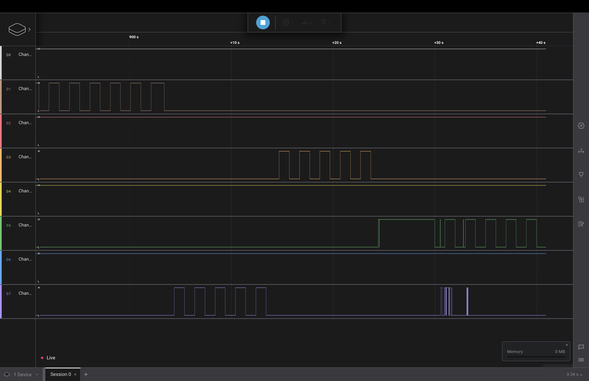

## Лабораторна робота №2

### Тема

LEDs, Buttons, Interrupts

### Виконання

### Код

Завдання виконане в поточній директорії.

### Відео виконання

Відео можна переглянути у youtube shorts <https://youtube.com/shorts/odFlsa0_Eug?feature=shared>

### Логічний аналізатор

 Блимання різних каналів, під'єнаних до підповідних пінів. Через розходження контактів виникла помарка.

### Висновок

На цій лабораторній роботі я вивчив як працювати з перериваннями під час натискання на кнопку, для оптимізації роботи процессора(не треба постійно перевіряти стан кнопки)
