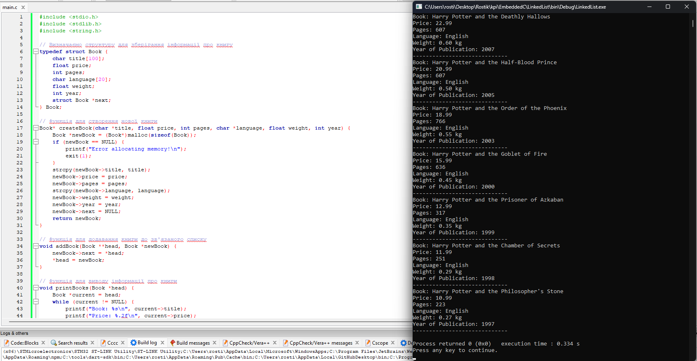

## Звязаний список

### Створити додаток який виводить на екран інформацію про серію книг про Гарі Поттера. Інформація проо книгах повинна міститися в зв'язаному списку

### Мета

Мета роботи - отримати початкові навички роботи з С

### Виконання

### Висновок

На цій практичній роботі я створив додаток, який виводить інформацію про книги Гаріка.
