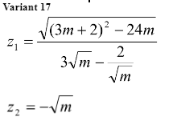
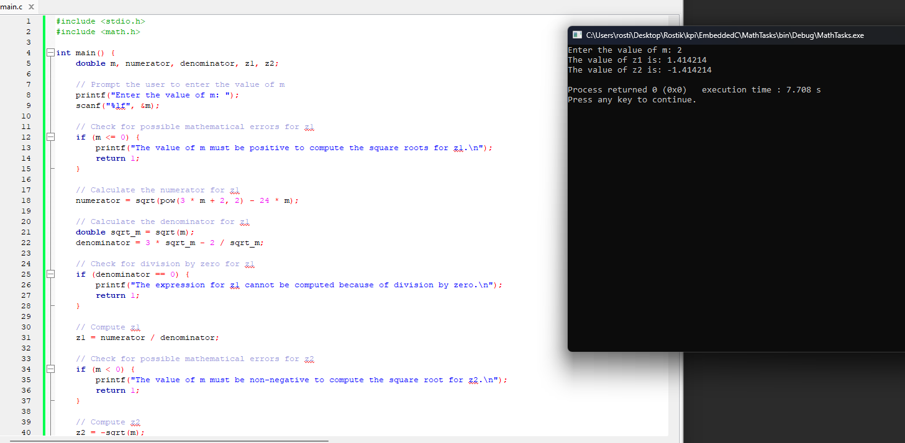

## Математичні рохрахунки

### Варіант 17

### Мета

Мета роботи - отримати початкові навички роботи з С

### Виконання

### Висновок

На цій практичній роботі я створив додаток, який робить математичні розрахунки згідно мого варіанту.
