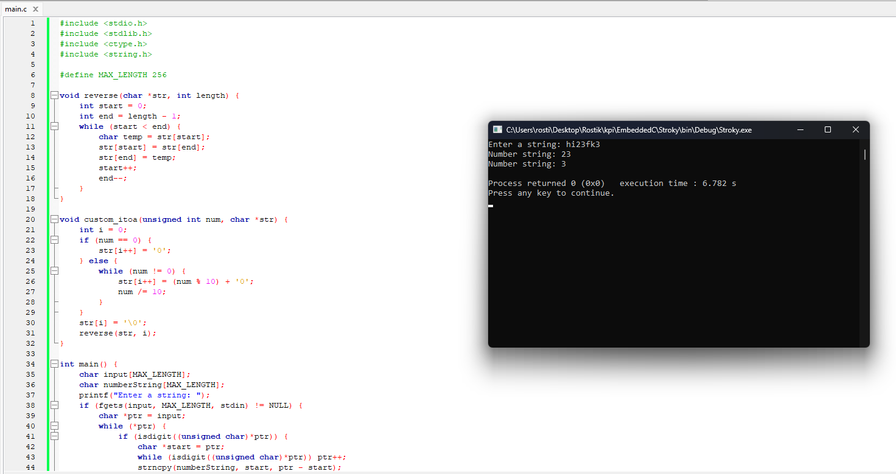

## Строки

### Варіант

17. Перетворення числа в строку (цілочисленне беззнакове)

### Мета

Мета роботи - отримати початкові навички роботи з С

### Виконання

### Висновок

На цій практичній роботі я створив додаток, який перетворює числа в строку.
